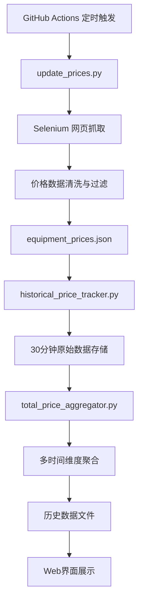

# 🍁 MapleStory 装备价格追踪系统

一个自动化的冒险岛装备价格监控和分析系统，提供实时价格追踪、历史数据分析和可视化图表功能。

## 📋 项目概述

本项目是一个全自动的冒险岛装备价格追踪系统，通过以下功能为玩家提供全面的市场价格信息：

- **🔄 自动价格更新**：每30分钟自动抓取最新装备价格
- **📊 多时间维度分析**：支持1小时、12小时、24小时的价格趋势分析
- **🎯 智能价格过滤**：采用IQR算法过滤异常价格，确保数据准确性
- **📈 可视化图表**：提供交互式价格走势图和比较功能
- **🌐 Web界面**：现代化的响应式网页界面
- **⚡ 高性能处理**：支持并行处理，快速更新大量装备数据

## 🏗️ 系统架构

### 核心组件

```
maplestory-price-tracker/
├── 📁 data/                          # 数据存储目录
│   ├── equipment_prices.json         # 当前装备价格数据
│   └── price_history/                # 历史价格数据
│       ├── *_1day.json              # 各装备的日价格历史
│       ├── total_price_*.json       # 总价格聚合数据
│       └── total_price_raw_data.json # 30分钟原始数据
├── 📁 scripts/                       # 核心脚本
│   ├── update_prices.py             # 价格更新主脚本
│   ├── historical_price_tracker.py  # 历史价格追踪
│   └── total_price_aggregator.py    # 总价格聚合器
├── 📁 .github/workflows/             # GitHub Actions自动化
│   └── update-prices.yml            # 自动更新工作流
├── index.html                        # Web界面
├── requirements.txt                  # Python依赖
└── README.md                         # 项目文档
```

### 数据流程



## 🚀 快速开始

### 环境要求

- Python 3.11+
- Chrome/Chromium 浏览器
- Git

### 本地安装

1. **克隆项目**
```bash
git clone https://github.com/your-username/maplestory-price-tracker.git
cd maplestory-price-tracker
```

2. **安装依赖**
```bash
pip install -r requirements.txt
```

3. **运行价格更新**
```bash
# 更新所有装备价格
python scripts/update_prices.py

# 更新指定数量的装备
TARGET_ITEMS=50 python scripts/update_prices.py
```

4. **启动历史数据追踪**
```bash
python scripts/historical_price_tracker.py
```

5. **生成聚合数据**
```bash
python scripts/total_price_aggregator.py
```

6. **查看Web界面**
```bash
# 使用任意HTTP服务器
python -m http.server 8000
# 访问 http://localhost:8000
```

## 📊 核心功能详解

### 1. 价格更新系统 (`update_prices.py`)

**主要特性：**
- 🔍 **智能价格检测**：使用Selenium自动化浏览器抓取价格
- 🛡️ **异常价格过滤**：采用IQR（四分位距）算法过滤异常数据
- ⚡ **并行处理**：支持多线程同时处理多个装备
- 🔄 **重试机制**：网络异常时自动重试
- 📝 **详细日志**：完整的操作日志记录

**价格过滤算法：**
```python
# 7数据点IQR过滤
iqr_multiplier = 1.0              # IQR倍数
minimum_data_points = 4           # 最少数据点
median_min_ratio = 10             # 中央值下限比例
median_max_ratio = 20             # 中央值上限比例
```

**环境变量配置：**
```bash
TARGET_ITEMS=ALL                  # 更新目标（ALL或数字）
FORCE_PRICE_DETECTION=true        # 强制价格检测
RELAXED_MODE=true                 # 宽松模式
```

### 2. 历史价格追踪 (`historical_price_tracker.py`)

**数据收集策略：**
- 📅 **30分钟原始数据**：每30分钟收集一次原始价格数据
- 📈 **多时间维度聚合**：
  - 1小时聚合：1周数据（168个数据点）
  - 12小时聚合：1个月数据（60个数据点）
  - 24小时聚合：1年数据（365个数据点）

**数据结构：**
```json
{
  "item_id": "1042256",
  "timestamps": ["2024-01-01T00:00:00", ...],
  "prices": [2490000, 2500000, ...],
  "interval": "1hour",
  "last_updated": "2024-01-01T12:00:00"
}
```

### 3. 总价格聚合器 (`total_price_aggregator.py`)

**功能：**
- 🔢 **市场总价值计算**：计算所有装备的总市场价值
- 📊 **趋势分析**：生成市场整体价格趋势
- 📈 **图表数据**：为Web界面提供图表数据

### 4. Web界面 (`index.html`)

**界面特性：**
- 📱 **响应式设计**：支持桌面和移动设备
- 🔍 **实时搜索**：支持装备名称、职业、等级过滤
- 📊 **交互式图表**：使用Chart.js提供价格走势图
- 🎯 **装备比较**：支持多装备价格对比
- 🎨 **现代UI**：渐变背景、卡片式布局

**主要功能区域：**
- 📈 **总价格图表**：显示市场整体价格趋势
- 📋 **装备列表**：可排序、可筛选的装备价格表
- 🔄 **实时更新**：显示最后更新时间和状态
- 📊 **统计信息**：总装备数、平均价格等统计数据

## 🤖 自动化部署

### GitHub Actions工作流

项目使用GitHub Actions实现全自动化运行：

**触发条件：**
- ⏰ **定时执行**：每30分钟自动运行
- 🔧 **手动触发**：支持手动执行并指定更新数量

**执行流程：**
1. 🔧 环境准备（Ubuntu + Python 3.11 + Chrome）
2. 📦 依赖安装（pip install requirements.txt）
3. 🔄 价格数据更新
4. 📊 历史数据处理
5. 📈 聚合数据生成
6. 💾 数据提交到仓库

**配置示例：**
```yaml
name: MapleStory Equipment Price Auto Update
on:
  schedule:
    - cron: '*/30 * * * *'  # 每30分钟执行
  workflow_dispatch:        # 支持手动触发
```

## 📈 数据分析功能

### 价格趋势分析

- **短期趋势**：1小时间隔，适合日内交易分析
- **中期趋势**：12小时间隔，适合周期性分析
- **长期趋势**：24小时间隔，适合投资决策

### 市场统计

- **总装备数量**：当前追踪的装备总数
- **平均价格**：所有装备的平均价格
- **价格分布**：高、中、低价格区间分布
- **更新状态**：数据更新成功率和状态

### 异常检测

- **IQR过滤**：自动识别和过滤价格异常值
- **时间序列异常**：检测价格突变和异常波动
- **数据质量监控**：监控数据收集的完整性和准确性

## 🔧 配置选项

### 环境变量

| 变量名 | 默认值 | 说明 |
|--------|--------|------|
| `TARGET_ITEMS` | `ALL` | 更新目标装备数量 |
| `FORCE_PRICE_DETECTION` | `true` | 强制价格检测 |
| `RELAXED_MODE` | `true` | 宽松模式（更积极的数据收集） |
| `TIME_THRESHOLD_RATIO` | `0.9` | 时间阈值比例 |
| `FORCE_DATA_REFRESH` | `true` | 强制数据刷新 |
| `FORCE_REBUILD_HISTORY` | `false` | 强制重建历史数据 |

### 价格过滤参数

```python
# IQR过滤设置
iqr_multiplier = 1.0              # IQR倍数（越小越严格）
minimum_data_points = 4           # 最少数据点要求
minimum_price_threshold = 10000   # 最低价格阈值

# 上下限过滤
median_min_ratio = 10             # 中央值下限比例
median_max_ratio = 20             # 中央值上限比例
final_price_ratio = 30            # 最高/最低价格比例上限
```

## 🛠️ 开发指南

### 添加新装备

1. 在价格抓取逻辑中添加新的装备ID
2. 更新装备分类和职业信息
3. 测试价格抓取功能
4. 验证历史数据记录

### 自定义价格过滤

```python
# 在update_prices.py中修改过滤参数
class GitHubActionsUpdater:
    def __init__(self):
        self.iqr_multiplier = 1.0      # 调整过滤严格程度
        self.minimum_data_points = 4   # 调整最少数据要求
```

### 扩展图表功能

```javascript
// 在index.html中添加新的图表类型
function createCustomChart(data) {
    // 自定义图表实现
}
```

## 📊 性能优化

### 并行处理

- **多线程抓取**：同时处理多个装备价格
- **智能负载均衡**：根据装备数量调整线程数
- **资源管理**：自动管理浏览器实例

### 数据存储优化

- **增量更新**：只更新变化的数据
- **压缩存储**：历史数据采用高效格式
- **缓存机制**：减少重复计算

### 网络优化

- **重试机制**：网络异常自动重试
- **超时控制**：避免长时间等待
- **连接池**：复用网络连接

## 🐛 故障排除

### 常见问题

**1. Chrome/ChromeDriver版本不匹配**
```bash
# 解决方案：更新ChromeDriver
pip install --upgrade webdriver-manager
```

**2. 价格抓取失败**
```bash
# 检查网络连接和目标网站状态
# 调整重试参数和超时设置
```

**3. 数据文件损坏**
```bash
# 重建历史数据
FORCE_REBUILD_HISTORY=true python scripts/historical_price_tracker.py
```

**4. GitHub Actions执行超时**
```bash
# 减少TARGET_ITEMS数量
# 优化并行处理参数
```

### 日志分析

```bash
# 查看详细日志
python scripts/update_prices.py 2>&1 | tee update.log

# 分析错误模式
grep "ERROR" update.log
grep "WARNING" update.log
```

## 📝 更新日志

### v2.0.0 (2024-01-01)
- ✨ 新增30分钟数据收集机制
- 📊 重构多时间维度聚合系统
- 🎨 优化Web界面用户体验
- ⚡ 提升并行处理性能
- 🛡️ 增强价格过滤算法

### v1.5.0 (2023-12-01)
- 📈 添加总价格趋势图表
- 🔄 改进自动化工作流
- 🐛 修复数据同步问题

### v1.0.0 (2023-11-01)
- 🎉 初始版本发布
- 🔍 基础价格抓取功能
- 📊 简单历史数据记录

## 🤝 贡献指南

欢迎提交Issue和Pull Request！

### 贡献流程

1. Fork项目
2. 创建功能分支 (`git checkout -b feature/AmazingFeature`)
3. 提交更改 (`git commit -m 'Add some AmazingFeature'`)
4. 推送分支 (`git push origin feature/AmazingFeature`)
5. 创建Pull Request

### 代码规范

- 遵循PEP 8 Python代码规范
- 添加适当的注释和文档
- 编写单元测试
- 更新相关文档

## 📄 许可证

本项目采用 MIT 许可证 - 查看 [LICENSE](LICENSE) 文件了解详情。

## 🙏 致谢

- [Selenium](https://selenium.dev/) - Web自动化框架
- [Chart.js](https://www.chartjs.org/) - 图表库
- [GitHub Actions](https://github.com/features/actions) - CI/CD平台
- MapleStory社区 - 数据来源和反馈

## 📞 联系方式

- 项目主页：[GitHub Repository](https://github.com/your-username/maplestory-price-tracker)
- 问题反馈：[GitHub Issues](https://github.com/your-username/maplestory-price-tracker/issues)
- 功能建议：[GitHub Discussions](https://github.com/your-username/maplestory-price-tracker/discussions)

---

**⭐ 如果这个项目对你有帮助，请给个Star支持一下！**